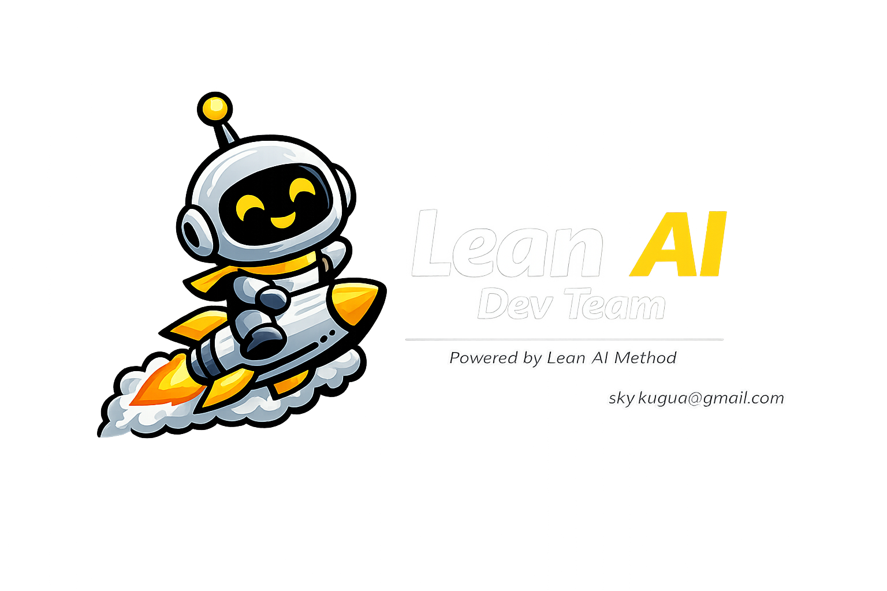

<div align="center">



# dev-team — Lean AI Dev Team Skill

[](LICENSE)
[](references/ide-compatibility.md)
[](https://claude.ai/code)
[](https://sky791016.github.io/lean-ai-dev-team/)

</div>

---

## English

### What It Does

A structured prompt system that routes your task through a **9-agent coordinated team** — from business strategy to production-ready code.

**Three core advantages:**

> **Cuts hallucinations** — Each agent is given only what it needs: the auditor reads code before diagnosing, the architect designs before developers build, the compliance PM checks consistency across all outputs. No agent guesses.

> **Minimum viable end-to-end loop** — Business case first, then requirements, then architecture, then parallel code, then 4-loop sign-off. You get a shippable increment with every run, not a pile of disconnected stubs.

> **Saves tokens** — Structured phase handoffs replace open-ended chat. No iterative clarification loops. One structured prompt → complete output across all 9 roles.

---

### Works With Any IDE

| IDE / Tool | How |
|---|---|
| **Claude Code** | Native `/dev-team` slash command |
| **Cursor** | Paste `SKILL.md` → `.cursorrules` |
| **Windsurf** | Paste `SKILL.md` → `AGENTS.md` |
| **GitHub Copilot** | Paste → `.github/copilot-instructions.md` |
| **JetBrains AI** | Settings → AI → Prompts → new prompt |
| **通义灵码** | Custom Instructions → paste `SKILL.md` |
| **CodeBuddy** | Instruction library → new → paste `SKILL.md` |
| **百度 Comate** | System prompt → paste `SKILL.md` |
| **Augment Code** | Workspace Instructions |
| **Continue.dev** | `config.json` → `systemMessage` |
| **Dify / Coze / FastGPT** | System prompt → paste `SKILL.md` |
| **Pure API** | `system` role → `SKILL.md` content |

Full setup guide: [`references/ide-compatibility.md`](references/ide-compatibility.md)

---

### Install

**Claude Code (one command):**
```bash
git clone https://github.com/sky791016/lean-ai-dev-team ~/.claude/skills/dev-team
```

**All other IDEs:**
Copy the contents of [`SKILL.md`](SKILL.md) into your IDE's system prompt / instruction file.

---

### Three Scenarios

**1 · Greenfield**
```
[全新项目]
Background: Legal team reviews 50+ contracts/day, avg 2 hrs each
Goal: Build a contract risk AI agent — auto-flag high-risk clauses
Constraints: Core ERP (SAP) must not be modified; human final sign-off required
Stack: Python Flask + PostgreSQL + React
```

All 9 agents activate. Output: ROI model → API contracts → parallel code → DoD sign-off.

**2 · Refactor**
```
[重构优化]
Current: Order query P99 = 4.2s, 3-year-old code, no test coverage
Goal: P99 under 500ms + AI personalized recommendations
Files: src/order/OrderService.java
Scale: MySQL, 80M rows
```

Code Auditor first → diagnoses bottlenecks → architect designs → devs implement.

**3 · Review**
```
[项目评审]
AI customer service system launching tomorrow — full review
Focus: Code security · AI hallucination risk · High concurrency · Data privacy
Files: src/chat/ChatController.java, src/ai/LLMService.java
Output: CTO-ready review report
```

Code Auditor + Architect + Compliance PM → security report → Go/No-Go.

Full examples: [`references/scenario-examples.md`](references/scenario-examples.md)

---

### The 9-Agent Team

```
Phase 0  Code Auditor               [required for refactor/review]
         OWASP security · N+1 detection · Architecture health score

Phase 1  Business Planner           [independent]
         L1-L5 scenario level · Business case · 3-phase roadmap

Phase 2  Product Manager            [independent]
         ROI model · Scenario card · KPI dashboard

Phase 3  Business Analyst           [independent]
         User stories · As-Is/To-Be · Given/When/Then criteria

Phase 4  Technical Architect        [independent]
         ADRs · API contracts · Clean Core design

Phase 5  Frontend  ─┐
(parallel) Backend  ─┤  All implement against architect's contracts
         Data       ─┘

Phase 6  Compliance PM
         4-loop check · Conflict report · DoD sign-off
```

---

### Real Results

| Case | Metric | Result |
|---|---|---|
| Contract Risk AI | Review time | −72% |
| Contract Risk AI | Annual savings | ¥2.4M |
| Customer Complaint AI | Response time | 8min → 90sec |
| Resume Screening AI | Screening time | 45min → 3min |

---

### Repository Structure

```
dev-team/
├── SKILL.md                          ← Skill definition (core file)
├── README.md
├── LICENSE
├── references/
│   ├── scenario-examples.md          ← Full prompt templates + output previews
│   └── ide-compatibility.md          ← Setup guide for all IDEs
└── assets/
    └── logo.png
```

---

### Citation

```bibtex
@software{lean_ai_dev_team_2026,
  author  = {Kai Shi (史凯)},
  title   = {Lean AI Dev Team — A 9-Agent AI Development Skill},
  year    = {2026},
  url     = {https://github.com/sky791016/lean-ai-dev-team},
  license = {Apache-2.0}
}
```

---

### License

Copyright © 2026 **Kai Shi (史凯)** · sky.kugua@gmail.com · Founder of Lean AI Method

Apache 2.0 with Non-Commercial Restriction.
Free for personal, educational, non-commercial use.
Commercial use → sky.kugua@gmail.com

---
---

## 中文说明

### 这是什么

一套结构化 Prompt 系统，将你的任务路由给 **9 个协作 AI 智能体**：先算清楚做不做、再设计系统、再并行实现、最后四闭环验收。

**三大核心优势，解决 AI 编程最痛的问题：**

> **大幅减少大模型幻觉** — 每个智能体只拿到它需要的上下文：审计师先读代码再诊断，架构师先设计再让开发动手，合规 PM 最后核查所有输出是否一致。没有任何一个智能体在猜测。

> **围绕目标直接交付最小 MVP 的端到端闭环** — 先商业价值，再需求，再架构，再并行编码，最后四闭环签核。每次运行都能拿到可交付的增量，而不是一堆互不相干的代码片段。

> **大幅节约 Token** — 结构化分阶段交接取代无目的的来回对话。不需要反复澄清需求。一个结构化 Prompt，9 个角色完整输出，直接到位。

---

### 兼容所有 IDE

| IDE / 工具 | 使用方式 |
|---|---|
| **Claude Code** | 原生 `/dev-team` 斜杠命令 |
| **Cursor** | 粘贴 `SKILL.md` → `.cursorrules` |
| **Windsurf** | 粘贴 `SKILL.md` → `AGENTS.md` |
| **GitHub Copilot** | 粘贴 → `.github/copilot-instructions.md` |
| **JetBrains AI** | 设置 → AI → 提示词 → 新建 |
| **通义灵码** | 自定义指令 → 粘贴 `SKILL.md` |
| **CodeBuddy** | 指令库 → 新建 → 粘贴 `SKILL.md` |
| **百度 Comate** | 系统提示词 → 粘贴 `SKILL.md` |
| **Augment Code** | Workspace Instructions |
| **Continue.dev** | `config.json` → `systemMessage` |
| **Dify / Coze / FastGPT** | 系统提示词 → 粘贴 `SKILL.md` |
| **纯 API** | `system` 角色 → `SKILL.md` 内容 |

完整配置手册：[`references/ide-compatibility.md`](references/ide-compatibility.md)

---

### 安装

**Claude Code（一条命令）：**
```bash
git clone https://github.com/sky791016/lean-ai-dev-team ~/.claude/skills/dev-team
```

**其他所有 IDE：**
将 [`SKILL.md`](SKILL.md) 的内容复制到你的 IDE 系统提示词 / 指令文件中。

---

### 三种使用场景

**1 · 全新项目**
```
[全新项目]

项目背景：法务团队每天审查 50+ 份合同，平均耗时 2 小时/份
目标：构建合同风险审查 AI 智能体，自动识别高风险条款并给出修改建议
约束：核心 ERP 不能修改，需要人工最终确认
技术栈：Python Flask + PostgreSQL + React
```

全部 9 个智能体激活。产出：ROI 模型 → API 契约 → 并行代码 → DoD 签核。

**2 · 重构优化**
```
[重构优化]

当前状况：订单查询 P99 延迟 4.2s，3 年前的代码，缺少测试覆盖
目标：P99 降到 500ms，同时接入 AI 个性化推荐
相关文件：src/order/OrderService.java
数据规模：MySQL，8000 万条订单
```

代码审计师优先运行 → 诊断瓶颈 → 架构师设计方案 → 开发并行实现。

**3 · 项目评审**
```
[项目评审]

AI 客服系统明天上线，全面评审
关注点：代码安全 · AI 幻觉风险 · 高并发 · 数据隐私合规
关键文件：src/chat/ChatController.java, src/ai/LLMService.java
要求：生成可给 CTO 汇报的评审报告
```

代码审计师 + 技术架构师 + 合规 PM → 安全报告 → 上线 Go/No-Go 建议。

完整示例和输出预览：[`references/scenario-examples.md`](references/scenario-examples.md)

---

### 9 智能体团队

```
Phase 0  代码审计师                   [重构/评审必跑]
         OWASP 安全 · N+1 检测 · 架构健康度评分

Phase 1  业务规划师                   [独立运行]
         L1–L5 场景分级 · 商业价值 · 三阶段路线图

Phase 2  产品经理                     [独立运行]
         ROI 测算 · 场景卡 · KPI 仪表盘

Phase 3  业务分析师                   [独立运行]
         用户故事 · As-Is/To-Be · Given/When/Then 验收标准

Phase 4  技术架构师                   [独立运行]
         ADR · API 契约 · Clean Core 设计

Phase 5  前端开发  ─┐
（并行）  后端开发  ─┤  全部按架构师契约实现
         数据集成  ─┘

Phase 6  合规项目管理
         四闭环检查 · 冲突报告 · DoD 签核
```

---

### 真实案例

| 案例 | 指标 | 结果 |
|---|---|---|
| 合同风险 AI | 审查时间 | 减少 72% |
| 合同风险 AI | 年节省 | ¥2.4M |
| 客诉处理 AI | 响应时间 | 8分钟 → 90秒 |
| 简历筛选 AI | 筛选时间 | 45分钟 → 3分钟 |

---

### 方法论

基于 **精益AI方法论（Lean AI Methodology）**，作者：**史凯（Kai Shi）**

> "AI 转型不是采购大模型，而是以业务场景为核心，对流程、数据、组织、技术、运营进行精益化重构。"

官网：[sky791016.github.io/lean-ai-dev-team](https://sky791016.github.io/lean-ai-dev-team/)

---

### 许可

Copyright © 2026 **Kai Shi (史凯)** · sky.kugua@gmail.com · Founder of Lean AI Method

Apache 2.0 附非商业限制。个人、教育、非商业用途免费。商业用途请联系 sky.kugua@gmail.com
