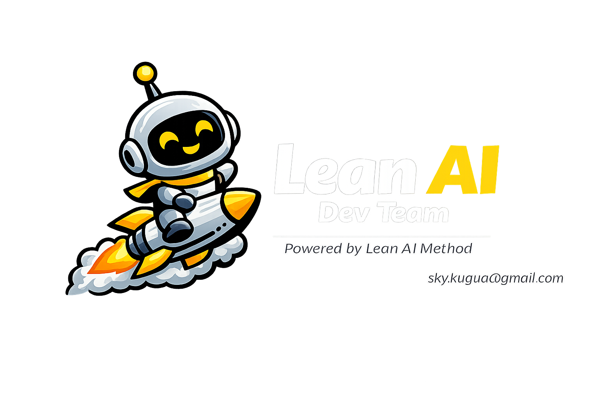

<div align="center">



# Lean AI Dev Team — Claude Code Skill
### 精益AI开发团队技能

**An 8-agent Claude Code skill that thinks in business value before writing a single line of code.**

**一个8智能体的 Claude Code 技能，先想清楚价值，再动手写代码。**

[](LICENSE)
[](https://claude.ai/code)
[](https://sky791016.github.io/lean-ai-dev-team/)
[](mailto:sky.kugua@gmail.com)

[**🌐 Website**](https://sky791016.github.io/lean-ai-dev-team/) · [**Quick Start**](#quick-start) · [**The 8 Agents**](#the-8-agent-team) · [**Real Results**](#real-results)

</div>

---

## The Problem / 问题所在

> *In the AI coding era, the bottleneck is no longer writing code — it's knowing which code to write, for whom, and why.*

> *在 AI 编程时代，瓶颈不再是写代码——而是知道该写哪段代码、为谁写、为什么写。*

Most AI-assisted development falls into **7 new wastes** / 大多数 AI 辅助开发都陷入了 **7 种新浪费**：

| # | Waste / 浪费 | What happens / 发生了什么 |
|---|---|---|
| W1 | **Scenario-less Code** · 无场景编码 | AI generates correct code for the wrong problem |
| W2 | **Metric-free Features** · 无指标功能 | Features ship with no KPIs — no one measures impact |
| W3 | **Hallucinated Architecture** · 幻觉架构 | AI invents APIs and modules that don't match your codebase |
| W4 | **Data Loop Neglect** · 数据回路缺失 | AI systems launch but never improve |
| W5 | **Governance Debt** · 治理债务 | Agents act without audit trails or human escalation |
| W6 | **Platform Before Scenario** · 平台先于场景 | Build AI platforms first, search for use cases second |
| W7 | **Trust Erosion** · 信任崩塌 | One critical mistake causes the team to abandon AI entirely |

**This skill eliminates all 7. / 本技能消除以上全部 7 种浪费。**

---

## Quick Start / 快速开始

```bash
# 1. Install / 安装
git clone https://github.com/sky791016/lean-ai-dev-team ~/.claude/skills/dev-team
```

Then in any Claude Code session / 然后在任意 Claude Code 会话中：

```
/dev-team Build a contract risk review AI agent
```

```
/dev-team 构建一个合同风险审查 AI 智能体
```

That's it. The 8-agent team takes over. / 就这样，8 个智能体接管后续所有工作。

---

## The 8-Agent Team / 8 智能体团队

Six sequential phases. Zero blind stubs — every agent reads existing code before writing.

六个顺序阶段，零盲目代码——每个智能体在编写前都先阅读现有代码。

```
Phase 1          Phase 2          Phase 3          Phase 4
业务规划师   ──▶  产品经理    ──▶  业务分析师   ──▶  技术架构师
Biz Planner      Product Mgr      Biz Analyst      Architect
  "Why?"          "Worth it?"     "What exactly?"   "How?"
                                                       │
                                          Phase 5 (Parallel / 并行)
                                    ┌──────────┬───────────┬──────────┐
                                    │  前端开发  │  后端开发  │  数据集成  │
                                    │ Frontend  │  Backend  │   Data   │
                                    └──────────┴───────────┴──────────┘
                                                       │
                                                   Phase 6
                                               合规项目管理
                                             Compliance PM
                                          4-Loop Check · DoD
```

| Phase | Agent | Key Outputs |
|---|---|---|
| **1** | 业务规划师 · Business Planner | Business case, L1–L5 scenario level, 3-phase roadmap, stakeholder map |
| **2** | 产品经理 · Product Manager | Lean AI scenario card, ROI model, KPI dashboard, go/no-go criteria |
| **3** | 业务分析师 · Business Analyst | User stories, As-Is → To-Be flows, Given/When/Then acceptance criteria |
| **4** | 技术架构师 · Technical Architect | ADRs, API contracts, Clean Core design, governance framework |
| **5a** | 前端开发 · Frontend | Component changes, human-AI collaboration UI, ops dashboard |
| **5b** | 后端开发 · Backend | API endpoints, service logic, audit logs |
| **5c** | 数据集成 · Data Integration | Migration SQL, knowledge base, data feedback loop |
| **6** | 合规项目管理 · Compliance PM | 4-loop check, conflict report, execution checklist, Definition of Done |

---

## The 4 Closed Loops / 四闭环检查

Every task is verified against four loops before sign-off. / 每项任务在交付前都经过四个闭环验证。

```
┌─────────────────────────────────────────────────────────────────┐
│                        4 CLOSED LOOPS                           │
│                                                                 │
│  💰  VALUE LOOP    What business problem? For whom? Measurable? │
│      价值闭环       业务目标是否覆盖？结果是否可量化？             │
│                                                                 │
│  🗄️   DATA LOOP    AI outputs feed back → continuous learning   │
│      数据闭环       数据有没有回流机制？AI输出能否改进未来模型？   │
│                                                                 │
│  🤖  MODEL LOOP    No vendor lock-in. Swap-ready architecture   │
│      模型闭环       架构是否支持未来模型升级？不依赖单一供应商     │
│                                                                 │
│  📈  OPS LOOP      KPIs + monitoring defined before launch      │
│      运营闭环       上线后监控是否就位？运营指标是否提前定义？     │
└─────────────────────────────────────────────────────────────────┘
```

---

## Real Results / 真实案例结果

Three enterprise deployments built with this methodology / 三个使用本方法论落地的真实企业案例：

### Contract Risk AI Agent / 合同风险审查智能体
| Metric | Before | After |
|---|---|---|
| Contract review time | baseline | **−72%** |
| Risk clause detection | baseline | **+58%** |
| Annual labor savings | — | **¥2.4M** |
| Time to MVP | — | **11 days** |

### Customer Complaint Assistant / 客户投诉处理助手
| Metric | Before | After |
|---|---|---|
| Avg response time | 8 min | **90 sec** |
| Agent adoption rate | — | **91%** |
| CSAT score | baseline | **+23 pts** |
| Time to MVP | — | **8 days** |

### Resume Screening AI / 简历筛选智能体
| Metric | Before | After |
|---|---|---|
| Screening time per candidate | 45 min | **3 min** |
| Quality-of-hire improvement | baseline | **+31%** |
| HR capacity freed | — | **60%** |
| Time to MVP | — | **14 days** |

---

## How It Works / 运行原理

```
You:  /dev-team Add a real-time fraud detection feature to our payment service

─────────────────────────────────────────────────────────────────────────
[Phase 1] Business Planner
  → reads your codebase, defines scenario level (L1–L5), maps stakeholders
  → output: business case + 3-phase roadmap

[Phase 2] Product Manager
  → validates ROI: how much to invest, how much saved, months to break even
  → output: scenario card + KPI dashboard + go/no-go criteria

[Phase 3] Business Analyst
  → translates strategy to engineering: user stories + acceptance criteria
  → output: Given/When/Then specs + As-Is → To-Be process maps

[Phase 4] Technical Architect
  → designs system BEFORE any code is written
  → output: ADRs + API contracts (all subsequent agents lock to this)

[Phase 5] Frontend + Backend + Data Integration (parallel)
  → build simultaneously, zero guesswork, all contracts enforced
  → every agent reads existing code before writing new code

[Phase 6] Compliance PM
  → runs 4-loop check, detects interface conflicts, signs off DoD
  → nothing ships without this sign-off
─────────────────────────────────────────────────────────────────────────
```

---

## The Methodology / 方法论背景

This skill implements the **Lean AI Methodology (精益AI方法论)** by **Kai Shi (史凯)**.

本技能是史凯《精益AI方法论》的工程实现。

> *"AI transformation is not model procurement — it is lean reconstruction of processes, data, organization, technology, and operations, with business scenarios as the core."*
>
> *"AI 转型不是采购模型——而是以业务场景为核心，对流程、数据、组织、技术、运营进行精益重构。"*
>
> — Kai Shi (史凯) · Founder of Lean AI Method

**10 Core Principles / 10 条核心原则**

| # | Principle | 原则 |
|---|---|---|
| 1 | Scenario First | 场景优先——先找场景，再选模型 |
| 2 | Value-Driven | 价值牵引——没有业务指标就不规模化投入 |
| 3 | Small Steps, Fast Cycles | 小步快跑——POC → MVP → 规模化 |
| 4 | Data Before Code | 数据先行——高质量 AI 需要高质量数据 |
| 5 | Knowledge Compounds | 知识沉淀——护城河是业务知识，不是模型 |
| 6 | Human-AI Collaboration | 人机协同——AI 重构分工，不取代人 |
| 7 | Controlled Execution | 受控执行——越接近业务，治理越严格 |
| 8 | Continuous Operations | 持续运营——上线是开始，不是终点 |
| 9 | Platform Grows from Scenarios | 场景孵化平台——不要先建平台 |
| 10 | Organizations Must Evolve | 组织必须进化——没有组织变革就没有真正的 AI 转型 |

### Publications / 出版著作

| Title | Publisher | Status |
|---|---|---|
| 精益数据方法论 · Lean Data Methodology | 机械工业出版社 | ✅ Published |
| 数据要素价值化蓝图 | 机械工业出版社 | ✅ Published |
| 高质量数据建设指南 | 机械工业出版社 | 🔜 Forthcoming |
| **Lean AI Methodology** (English edition) | **Springer Nature** | 🔜 Forthcoming |

---

## Repository Structure / 仓库结构

```
lean-ai-dev-team/
├── index.html            # Bilingual landing page (zh/en auto-detect)
├── logo.png
├── skills/
│   └── dev-team/
│       └── SKILL.md      # Claude Code skill definition (the core file)
├── role-cards/
│   ├── zh/               # 9 persona cards in Chinese
│   └── en/               # 9 persona cards in English
├── analytics/
│   ├── tracker.gs        # Google Apps Script visitor tracker
│   └── SETUP.md          # Analytics setup guide
├── gen_role_cards.py      # Card generator (Pillow)
└── qrcode-poster.png      # QR poster for sharing
```

---

## Citation / 引用

If you use this in your research or projects, please cite:

如果你在研究或项目中使用了本技能，请注明出处：

```bibtex
@software{lean_ai_dev_team_2026,
  author    = {Kai Shi (史凯)},
  title     = {Lean AI Dev Team — An 8-Agent Claude Code Skill},
  year      = {2026},
  url       = {https://github.com/sky791016/lean-ai-dev-team},
  note      = {Based on Lean AI Methodology (精益AI方法论)},
  license   = {Apache-2.0}
}
```

Or simply / 或简单注明：

> Powered by [Lean AI Dev Team](https://github.com/sky791016/lean-ai-dev-team) — Kai Shi (史凯), 2026

---

## Contributing / 贡献

Issues and PRs welcome. Please open an issue first for significant changes.

欢迎提交 Issue 和 PR，重大改动请先开 Issue 讨论。

---

## License / 许可证

Copyright © 2026 **Kai Shi (史凯)** · Founder of Lean AI Method · sky.kugua@gmail.com

Licensed under **Apache License 2.0** with Non-Commercial Restriction:

- ✅ Free for personal, educational, and internal non-commercial use
- ✅ Free to modify and redistribute with attribution
- ❌ Commercial use requires written authorization → sky.kugua@gmail.com

All copies must retain:
> *"Lean AI Dev Team — Copyright © 2026 Kai Shi (史凯), Founder of Lean AI Method"*

---

<div align="center">

**[sky791016.github.io/lean-ai-dev-team](https://sky791016.github.io/lean-ai-dev-team/)**

Made with the Lean AI Methodology · 基于精益AI方法论构建

**Kai Shi (史凯)** · sky.kugua@gmail.com

*Forthcoming: Lean AI Methodology — Springer Nature*

</div>
